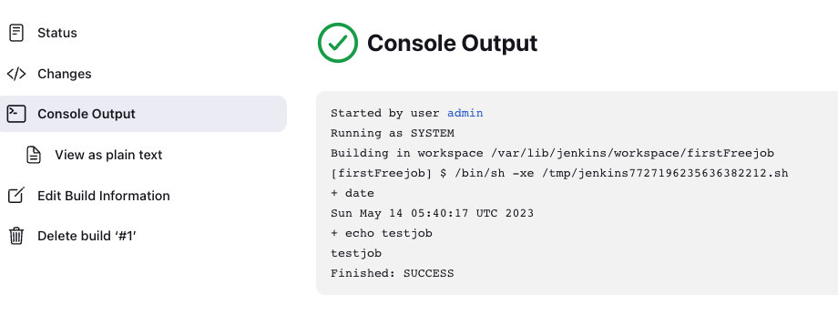
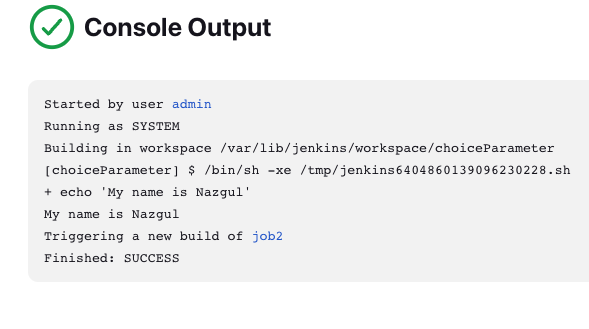

# Jenkins Job

In Jenkins the term job is synonymous with project. The number of job types depends on the plugins that you have installed. For example, Maven job is only available if you installed the Maven plugin.

## Freestyle project

Default project type, most flexible to configure.

## Pipeline project

Defining entire build process using code in the form of Jenkins file

```
Dashboard -> Create job -> firstFreeJob -> get Description -> Build steps -> Execute shell -> date echo "testjob" -> Save -> Build now
```



Second job:
You can add the post build action: build other projects, build other projects when current job is done.



In a Jenkins, we can install various of plugins like Kubernetes, Jenkins has tons of plugins, some companies put restriction to install plugins due to security issues. 

