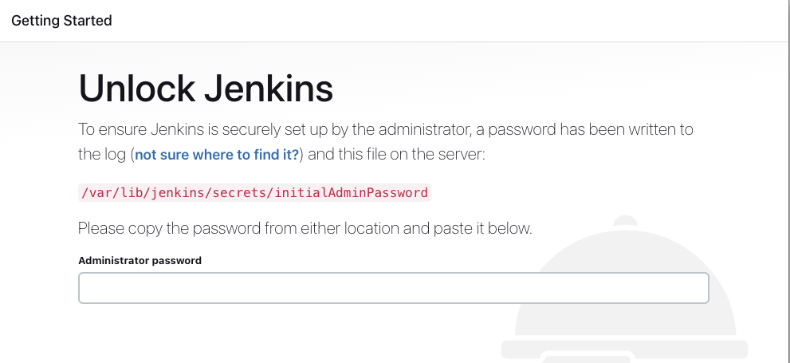

# Create a CI/CD pipeline for a simple web application Python Flask using Jenkins

Prerequisites:
1. Create Ubuntu 22.04 Virtual Machine
2. Install jenkins server and run it

```
Step 1 - Update the System
apt update -y
apt upgrade -y

After updating all the system packages, install other required dependencies using the following command.
apt install curl debian-archive-keyring lsb-release ca-certificates apt-transport-https software-properties-common -y

Step 2 - Install Java
Jenkins is a java based application. So, you will need to install Java on your server. You install it by just running the following command.
apt install openjdk-11-jdk-headless -y

java --version
openjdk 11.0.19 2023-04-18
OpenJDK Runtime Environment (build 11.0.19+7-post-Ubuntu-0ubuntu122.10.1)
OpenJDK 64-Bit Server VM (build 11.0.19+7-post-Ubuntu-0ubuntu122.10.1, mixed mode, sharing)

Step 3 - Install Jenkins
By default, the Jenkins package is not included in the Ubuntu repository. So you will need to add the Jenkins repository to APT.

First, download the Jenkins GPG key with the following command.
wget -q -O - https://pkg.jenkins.io/debian-stable/jenkins.io.key | gpg --dearmor -o /usr/share/keyrings/jenkins.gpg

Next, add the Jenkins repository to APT with the following command.
sh -c 'echo deb [signed-by=/usr/share/keyrings/jenkins.gpg] http://pkg.jenkins.io/debian-stable binary/ > /etc/apt/sources.list.d/jenkins.list'

Once the repository is added, you can update the repository cache with the following command.
apt update -y

Then, install the Jenkins package using the following command.
apt install jenkins -y

Step 4 - Manage Jenkins Service
By default, the Jenkins service is managed by systemd. You manage it easily using the systemctl command.

Let’s start the Jenkins service with the following command.
systemctl start jenkins

Then, enable the Jenkins service so that it will start at system reboot.
systemctl enable jenkins

Now verify the Jenkins status using the following command.
systemctl status jenkins
```

on webBrowser type IP:8080

