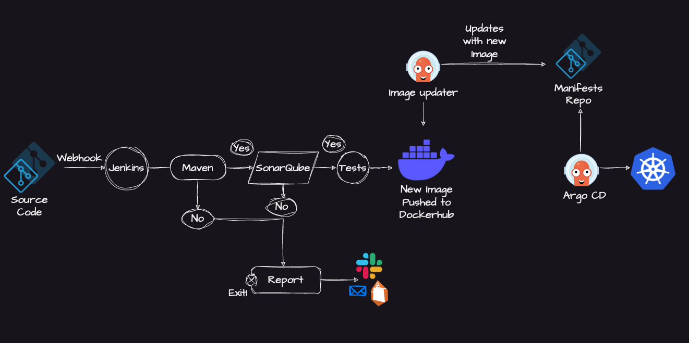
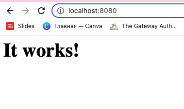
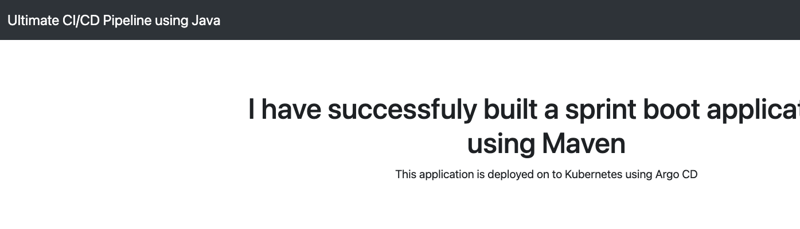
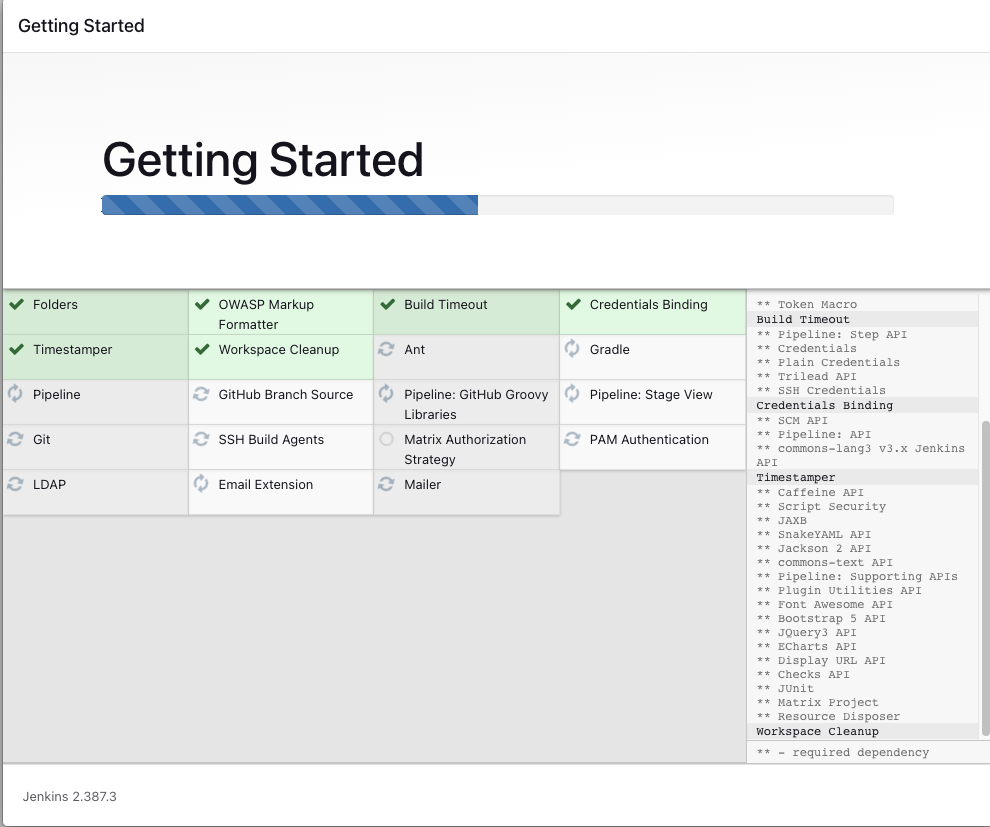

# Jenkins Pipeline for Java based application using Maven, SonarQube, Argo CD, Helm and Kubernetes

In this project I have to use 2 GitHib repositories for source code and manifests repo.
Jenkins pipeline is doing Continious Integration  -> Webhook -> Jenkins -> Maven - if yes -> SonarQube ->  Tests -> New Image pushed to DockerHub
Code stored in Git repo -> Jenkins is responsible to watching commits onto this repo, whenever the changes or PR commited,
Jenkins Pipeline has to be triggered.
There are a lot of ways how the Jenkins Pipeline can be notified, the most efficient way is to use webhook, whenever you are using
the webhook, instead of the Jenkins is watching the repo, the Git send the notifications to Jenkins, in GitHub setting you will have the options to set the webhook URL, can define for  which action webhook has to be triggered, you can say Webhook has to be triggered on Commit or Pull Request. Whenever the Developer has created the PR or Commit, Git  will send the notification to Jenkins (Orchestrator tool) and ask Jenkins to start trigger the pipeline. Without using the GitHub WebHooks, if you are pulling continiously, or doing periodic build triggers, Jenkins continiously try to send requests to Git and try to fetch the information. 
In this case you are making a lot of API calls to git, whereas when you are using the webhooks, it only sends notifications or triggers whenever the specific action is performed. 

For this purpose I use the Jenkinsfile, for perform set of actions, use Maven for build the application. Then use the Docker Agent,
when use the the Docker agent, we do not have to worry about the installation at all, build with agent, unit test will be run. 
After unit test, static code analysis are passed successfully, can go to the next stage. The Docker Agent is very lightweight, useful, with using the Agent you cannot worry about installation issues, whenevr you are using the tools, Docker Agent will help with operation.

After can use the Jenkins email notifications, AWS Email notifications. If Build success, can integrate SonarQube- security code scanning tools, verify what happened in previous stages. Does it have the errors or security vulnerabilities, can sen the notification, can proceed with docker image. 
This pipeline is send the image to Docker registry, or Container registry, it can be Docker Hub, query.io, Elastic Container Registry.

Once pushed the last stage of the CI pipeline, how CI and CD communicate with each other, after that for Cd people used Ansible playbooks or Shell scripts, which will deploy or push artifacts to Kubernetes or any other target platform. But this is not much scalable, ansible or shell scripts are not designed for Continious Delivery. 

You have to choose CD tool, best CD tool is GITOPS base tool, similar to Github you have to create the repo for manifests also.
Argo Image Updator od Shell Script, GitHub Actions -> it can monitor container registry -> directly update Git repo with new yaml files or helm charts, ARGO CD -> whenever there is the change in the repo, take the yaml files - as soon as the commit created GITOPS tools is sitting in the Kubernetes cluster, whenever there is volume, image Argo Cd is deploy to repo. 

Steps:
```
I have a Git repo -> our app source -> as soon as developer push PR to Git repo ->  using the webhook - > 
trigger declarative Jenkins pipelines -> Using Maven as build language  build stage -> if it's successfully here is perform build tests-> using static code analysis -> fast/dash tools where we veryfy app security -> if any othese steps failed -> sent email or slack notification -> Success -> create Docker Image -> as soon as Docker image creared -> push the i,age to Docker Hub/ ECR/quai.io

Inside the Kuberenetes cluster -> deployed Argo Image Updator and Argo Cd -> Kubernetes controller -> Argo Image Updator -cont. monitor container registry -> it will pick the image and update that image and push to another repository -image, helm charts, customize yaml files -> Argo Cd it take new images and deploys to Kubernetes cluster.
```



```
sudo apt update
java -version
Output
Command 'java' not found, but can be installed with:

sudo apt install default-jre              # version 2:1.11-72build1, or
sudo apt install openjdk-11-jre-headless  # version 11.0.14+9-0ubuntu2
sudo apt install openjdk-17-jre-headless  # version 17.0.2+8-1
sudo apt install openjdk-18-jre-headless  # version 18~36ea-1
sudo apt install openjdk-8-jre-headless   # version 8u312-b07-0ubuntu1

sudo apt install default-jre
java -version
openjdk version "11.0.19" 2023-04-18
OpenJDK Runtime Environment (build 11.0.19+7-post-Ubuntu-0ubuntu122.04.1)
OpenJDK 64-Bit Server VM (build 11.0.19+7-post-Ubuntu-0ubuntu122.04.1, mixed mode, sharing)

You may need the JDK in addition to the JRE in order to compile and run some specific Java-based software. To install the JDK, execute the following command, which will also install the JRE:
sudo apt install default-jdk

javac -version
javac 11.0.19

sudo update-alternatives --config java
There is only one alternative in link group java (providing /usr/bin/java): /usr/lib/jvm/java-11-openjdk-amd64/bin/java
Nothing to configure.

sudo update-alternatives --config javac
There is only one alternative in link group javac (providing /usr/bin/javac): /usr/lib/jvm/java-11-openjdk-amd64/bin/javac
Nothing to configure

sudo nano /etc/environment
JAVA_HOME="/usr/lib/jvm/java-11-openjdk-amd64"

source /etc/environment

echo $JAVA_HOME
/usr/lib/jvm/java-11-openjdk-amd64

# Install maven
sudo apt install maven

#Execute the Maven targets to generate the artifacts
mvn clean package
```

Teh above maven target stores the artifacts to the target directory, can either execute the artifact on your local machine (or) run it as a Docker container.

Execute locally (Java 11 needed) and access the application on http://localhost:8080

```
java -jar target/spring-boot-web.jar
```



Next Steps:
The Docker way
```
sudo apt update

Next, install a few prerequisite packages which let apt use packages over HTTPS:
sudo apt install apt-transport-https ca-certificates curl software-properties-common

Then add the GPG key for the official Docker repository to your system:
curl -fsSL https://download.docker.com/linux/ubuntu/gpg | sudo gpg --dearmor -o /usr/share/keyrings/docker-archive-keyring.gpg

Add the Docker repository to APT sources:
echo "deb [arch=$(dpkg --print-architecture) signed-by=/usr/share/keyrings/docker-archive-keyring.gpg] https://download.docker.com/linux/ubuntu $(lsb_release -cs) stable" | sudo tee /etc/apt/sources.list.d/docker.list > /dev/null

Update your existing list of packages again for the addition to be recognized:
sudo apt update

Make sure you are about to install from the Docker repo instead of the default Ubuntu repo:
apt-cache policy docker-ce

Notice that docker-ce is not installed, but the candidate for installation is from the Docker repository for Ubuntu 22.04 (jammy).

Finally, install Docker:
sudo apt install docker-ce

Docker should now be installed, the daemon started, and the process enabled to start on boot. Check that it’s running:
sudo systemctl status docker

Build the Docker Image

docker build -t ultimate-cicd-pipeline:v1 .
docker run -d -p 8010:8080 -t ultimate-cicd-pipeline:v1

Access the application on http://<ip-address>:8010
```



Install jenkins

```
curl -fsSL https://pkg.jenkins.io/debian-stable/jenkins.io-2023.key | sudo tee \
  /usr/share/keyrings/jenkins-keyring.asc > /dev/null
echo deb [signed-by=/usr/share/keyrings/jenkins-keyring.asc] \
  https://pkg.jenkins.io/debian-stable binary/ | sudo tee \
  /etc/apt/sources.list.d/jenkins.list > /dev/null
sudo apt-get update
sudo apt-get install jenkins

You can enable the Jenkins service to start at boot with the command:
sudo systemctl enable jenkins

You can start the Jenkins service with the command:
sudo systemctl start jenkins

You can check the status of the Jenkins service using the command:
sudo systemctl status jenkins
```

open <IP:8080>

Install preferred plugins, login using the cat /var/lib/jenkins/secrets/initialAdminPassword



