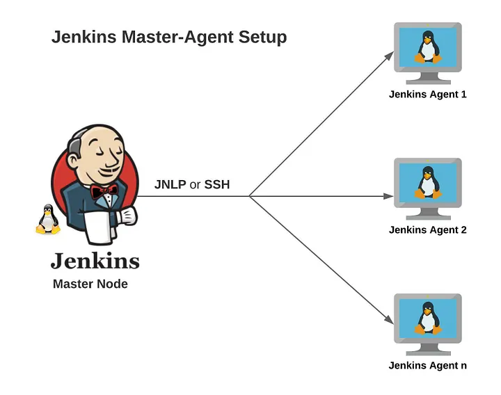
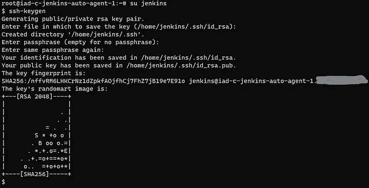
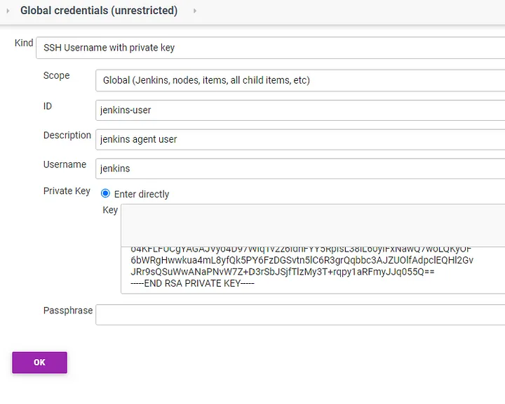
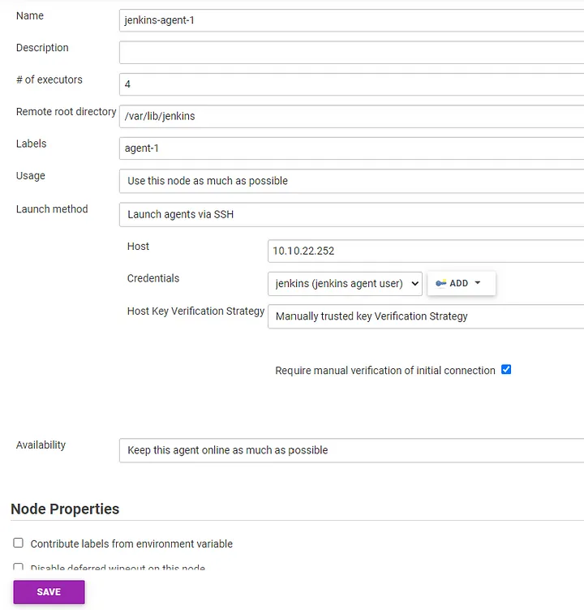
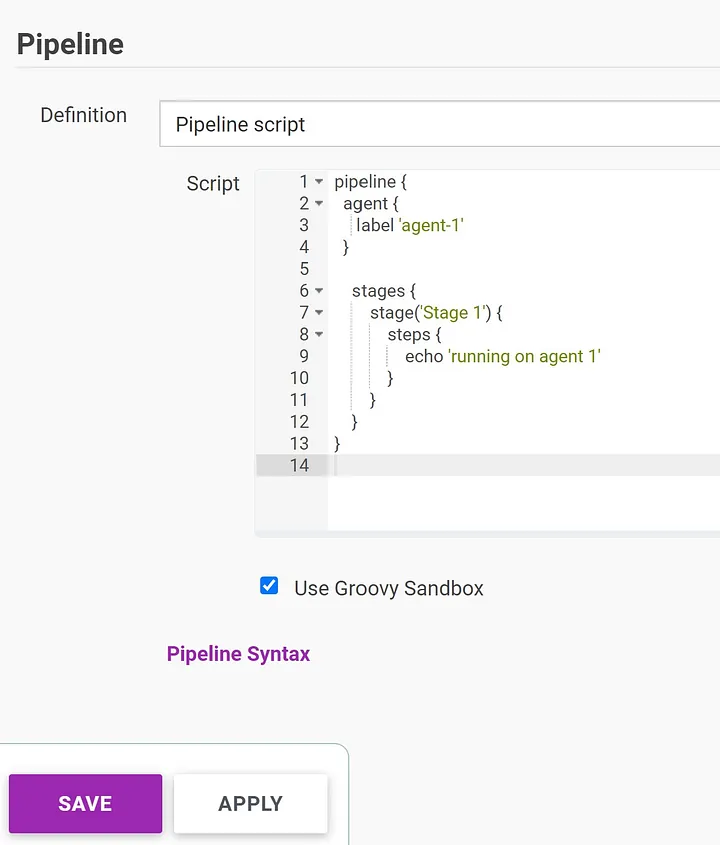
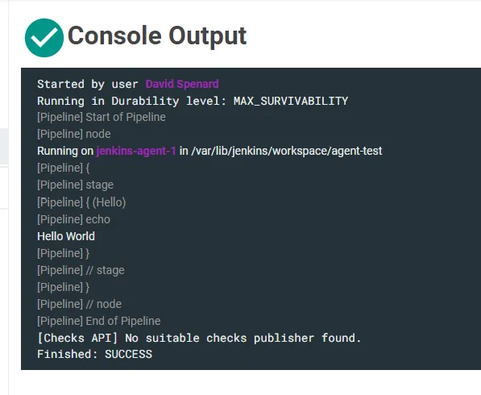

# Adding the Remote Agent to Jenkins Master



With Jenkins you can automate anything. In my case My Master and Agent are running on Digital Cloud. Configure Agent Node in Jenkins.

SSH Connection (the better way)
Step 1 — Set up Jenkins Master instance, install java 11 and jenkins

Step 2 — Set up Jenkins Agent instance

Then create a key pair for this user.



And then cat the private key file and copy the entire contents to the clipboard to use later in the Jenkins UI.
```
$ cat ~/.ssh/id_rsa
```

Step 3 — Create credentials in Jenkins
Proceed to the URL for the Jenkins Master to load the UI in the browser.

Under Manage Jenkins, choose Manage Credentials and then select the credentials store link for global and then choose Add Credentials. Create credentials for ‘SSH Username with private key’ and paste in the private key contents copied from step 2 above.



Under Manage Jenkins, choose Manage Nodes and Clouds to configure the Agent Node connection. If you followed along and set up the Agent Node to use JLNP, then be sure to label this Agent Node configuration something different, as Jenkins will allow you to create duplicate labels. The remote root directory must match the directory created on the Agent instance and the launch method should be ‘Launch agents via SSH’. Provide the IP or host name for the Agent instance and select the credential created in Step 3 above. For Host Key Verification Strategy, it’s easier to choose ‘Manually trusted key Verification Strategy’, and then check the box for ‘Require manual verification of initial connection’. Non-verifying Verification Strategy should not be used, as that leaves you vulnerable to a man-in-the-middle attack.



Step 6— Add public key to the authorized_keys on Agent instance
Back in the Agent instance, the public key for the jenkins user created in step 2 above needs to be added to the list of authorized_keys. This will allow the Master node to talk to the Agent node over SSH using the credentials set up in Jenkins.

Step 7— Run a Job in Jenkins to test the Agent node
Create a simple job to use the Agent node. In my case I tested with a simple pipeline script and specified the agent label to use the Agent set up in step 4 above.



