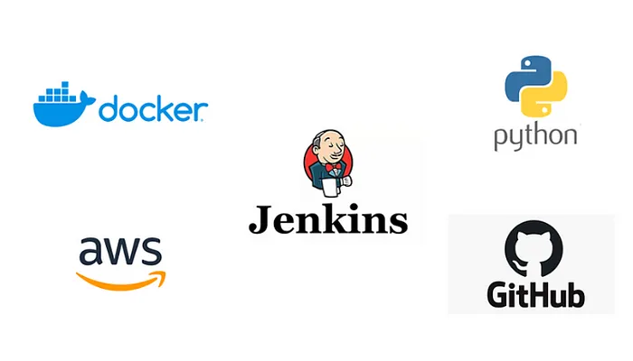
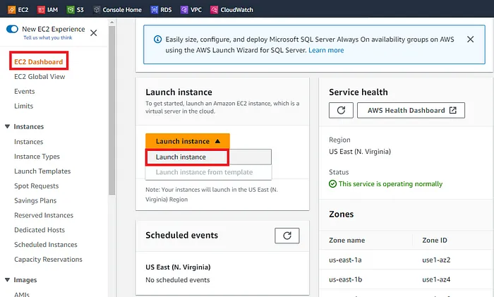
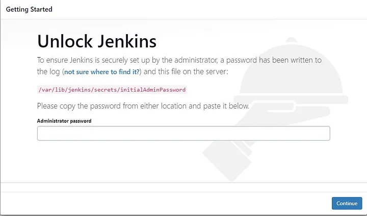
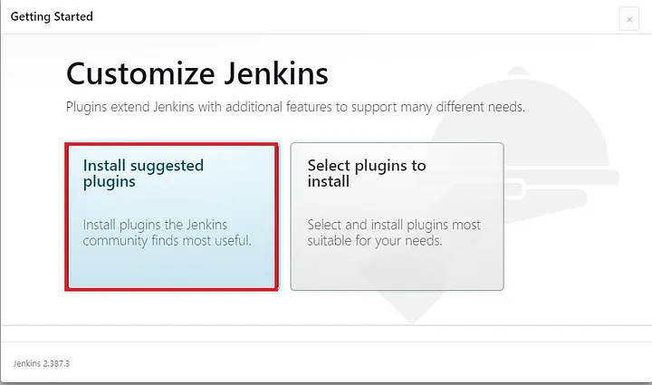

# Set up a CICD Pipeline using Jenkinsfile and Docker on AWS EC2

CICD is an essential part of DevOps. Build CI/CD platform can maximize development time by improving organization's productivity, increasing efficiency, and streamlining workflows though built-in automation, testing, and collaboration.

## Continuous Integration

Continuos integration is a software development practice where developers regularly merge their code changes into central repository, after which automated build and tests are run. Here utilize Jenkins as Continuos Integration tool to automatically build and test our application every time code changes are made. This will help us to identify issues early in the development process, allowing for faster feedback and remediation.

## Continuos Delivery/Deployment

Continuos Delivery is a software development practice where code changes are automatically built, tested and prepared for a release to production. Here again, we will use jenkins to automatically deploy our application to a server or Docker registry, when the build and tests phase are successful, ensuring that the latest version of app is always available to end-users. this ensures Continuos Delivery/Deployment and reduces the time to market for application.

Continuos testing - core DevOps practice that provides a continual assessment of changes throughout the development process. Application will be continuously tested while the Docker image is run as part of the pipeline process, helping identify any issues early.

## Infrastructure as Code

IaC is a practice in which infrastructure is provisioned and managed using code and software development techniques, such as version control and continuous integration. leverage Jenkins pipeline scripting to automate the build, test and deployment process of application. This pipeline script can be version-controlled and treated as code, making it easier to manage and reproduce the pipeline.

## Webhook Triggers

We will set up the webhook triggers to automatically trigger pipeline build whenever changes are pushed to the Git repository. this ensures that our application is continuously built and tested.

## Docker

We will containerize application using Docker to make it more portable and scalable. Docker allows us to package application and its dependencies into a single, portable unit that can be run consistently on any platform.

## Git

Use Git to manage the source code of application, making it easier to collaborate and for version-control changes.

We will set up a CI/Cd pipeline using Jenkins and Docker by building the simple Flask application, testing it, and deploying it to Docker hub.

Containerize a simple Flask application using Docker to make it more portable and scalable.
Use Git to manage the source code of the application to make it easier to collaborate and version-control changes.
Implement Infrastructure as Code for automated build, test, and deployment process using Jenkins pipeline script.
Ensure Continuous Integration of the application by configuring Jenkins to automatically build and test every time code changes are made.
Implement Continuous Delivery/Deployment by configuring Jenkins to automatically deploy the application to a Docker registry when the build and test phases are successful.

Step 1: Create an EC2 instance
Log in to the Amazon management console, open EC2 Dashboard, click on the Launch Instance drop-down list, and click on Launch Instance as shown below:

Step 2: Install Jenkins

Navigate to /var/lib/jenkins/secrets/initialAdminPassword and copy the password and unlock Jenkins.

Then Install the suggested plugins:

Let’s install the Docker Plugin.

Click on Manage Jenkins -> Manage Plugins -> Available Plugins and install without restart the Docker plugin.

