# Set up a CICD Pipeline using Jenkinsfile and Docker on AWS EC2


CICD is an essential part of DevOps. Build CI/CD platform can maximize development time by improving organization's productivity, increasing efficiency, and streamlining workflows though built-in automation, testing, and collaboration.

## Continuous Integration

Continuos integration is a software development practice where developers regularly merge their code changes into central repository, after which automated build and tests are run. Here utilize Jenkins as Continuos Integration tool to automatically build and test our application every time code changes are made. This will help us to identify issues early in the development process, allowing for faster feedback and remediation.

## Continuos Delivery/Deployment

Continuos Delivery is a software development practice where code changes are automatically built, tested and prepared for a release to production. Here again, we will use jenkins to automatically deploy our application to a server or Docker registry, when the build and tests phase are successful, ensuring that the latest version of app is always available to end-users. this ensures Continuos Delivery/Deployment and reduces the time to market for application.

Continuos testing - core DevOps practice that provides a continual assessment of changes throughout the development process. Application will be continuously tested while the Docker image is run as part of the pipeline process, helping identify any issues early.

## Infrastructure as Code

IaC is a practice in which infrastructure is provisioned and managed using code and software development techniques, such as version control and continuous integration. leverage Jenkins pipeline scripting to automate the build, test and deployment process of application. This pipeline script can be version-controlled and treated as code, making it easier to manage and reproduce the pipeline.

## Webhook Triggers

We will set up the webhook triggers to automatically trigger pipeline build whenever changes are pushed to the Git repository. this ensures that our application is continuously built and tested.

## Docker

We will containerize application using Docker to make it more portable and scalable. Docker allows us to package application and its dependencies into a single, portable unit that can be run consistently on any platform.

## Git

Use Git to manage the source code of application, making it easier to collaborate and for version-control changes.

We will set up a CI/Cd pipeline using Jenkins and Docker by building the simple Flask application, testing it, and deploying it to Docker hub.

Containerize a simple Flask application using Docker to make it more portable and scalable.
Use Git to manage the source code of the application to make it easier to collaborate and version-control changes.
Implement Infrastructure as Code for automated build, test, and deployment process using Jenkins pipeline script.
Ensure Continuous Integration of the application by configuring Jenkins to automatically build and test every time code changes are made.
Implement Continuous Delivery/Deployment by configuring Jenkins to automatically deploy the application to a Docker registry when the build and test phases are successful.

Step 1: Create an EC2 instance
Log in to the Amazon management console, open EC2 Dashboard, click on the Launch Instance drop-down list, and click on Launch Instance as shown below:


Step 2: Install Jenkins


Navigate to /var/lib/jenkins/secrets/initialAdminPassword and copy the password and unlock Jenkins.

Then Install the suggested plugins:


Let’s install the Docker Plugin.

Click on Manage Jenkins -> Manage Plugins -> Available Plugins and install without restart the Docker plugin.

Step 3: Install Docker
Now on our Jenkins server let’s install the Docker with:

```
sudo yum update

Search for Docker package:
sudo yum search docker

Get version information:
sudo yum info docker

Install docker, run:
sudo yum install docker

Add group membership for the default ec2-user so you can run all docker commands without using the sudo command:
sudo usermod -a -G docker ec2-user
id ec2-user
# Reload a Linux user's group assignments to docker w/o logout
newgrp docker

docker-compose
wget https://github.com/docker/compose/releases/latest/download/docker-compose-$(uname -s)-$(uname -m) 
sudo mv docker-compose-$(uname -s)-$(uname -m) /usr/local/bin/docker-compose
sudo chmod -v +x /usr/local/bin/docker-compose

Enable docker service at AMI boot time:
sudo systemctl enable docker.service

Start the Docker service:
sudo systemctl start docker.service

Get the docker service status on your AMI instance, run:
sudo systemctl status docker.service

Getting docker version info on Amazon Linux
The docker-compose is installed in ‘/usr/local/bin’ directory and it may not be on your PATH settings. To see current PATH settings run the echo command/printf command:
echo "$PATH"
To add /usr/local/bin/ path to your bash startup file such as ~/.profile or ~/.bash_profile using the export command:

export PATH=$PATH:/usr/local/bin
Another option for developers is to use the find command to locate the docker-compose file as follows:

sudo find / -name "docker-compose" -ls
See “add $PATH permanently on Linux” for more info.

See docker version:
docker version

Also verify that docker-compose install was a success on AMI by running the following command:
docker-compose version
```

Step 4: Configure your DockerHub Credentials
Create an account in DockerHub or log into your existing DockerHub account. Go to ‘Account Settings’ under your account name and then ‘Security’ as shown below to create a token:

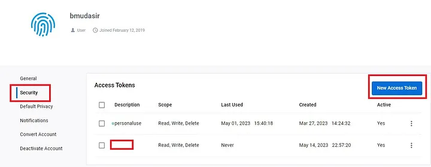

Make sure to save your access token since it only appears one time when generating it.

Now we will add this token to our Jenkins UI. For that, go to Manage Jenkins -> Credentials -> System -> Global credentials -> + Add credentials. Enter your Docker Hub username, provide any ID (make sure you place this same ID under Environment Variables later), and a brief description of the credentials.

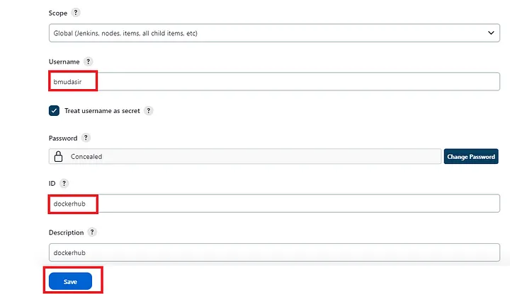

Step 5: Create Environment Variables
Now we will create the environment variables which we will use later in the Jenkinsfile for the Docker image and for the Docker Hub credentials.

Go to Manage Jenkins -> Configure System and under ‘Global properties’ add them as shown in the picture below.

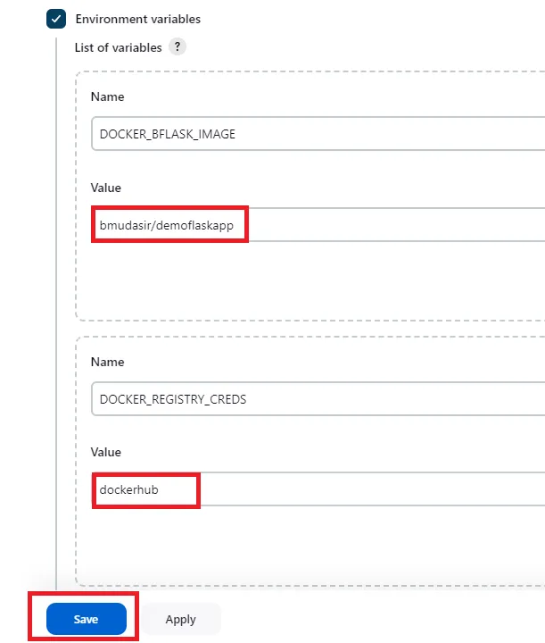

Click on Apply and Save to Continue.

Step 6: Create Jenkins Job
In your Jenkins Dashboard go to New Item -> Pipeline and enter the name of your project.

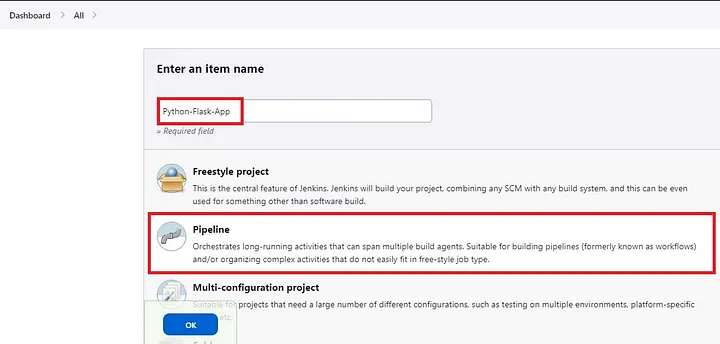

Now we will configure this new job. Under General, give some description of your project. Select GitHub project among the options and add the link of your GitHub repository as shown below:

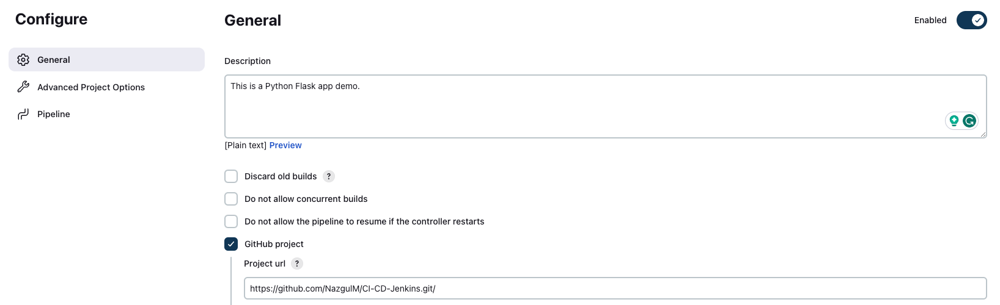

Now in the Pipeline section, under SCM select ‘Git’ and enter the URL of the repository again.

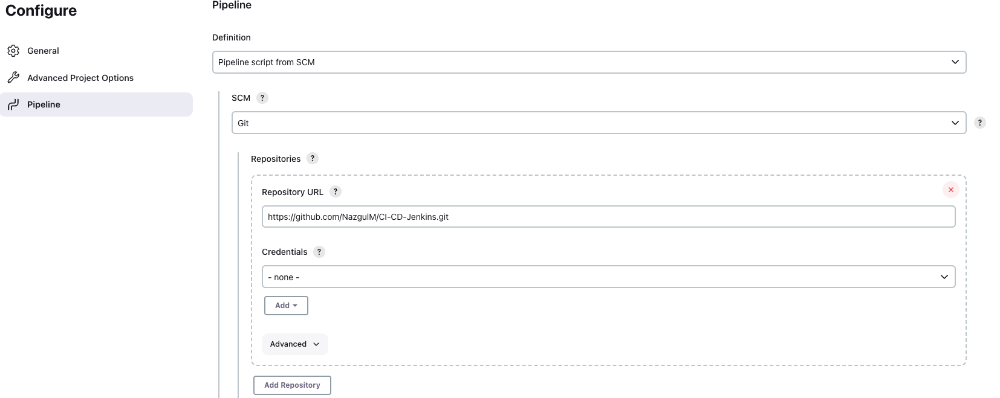

Note: In case your repository is private then you need to add your GitHub credentials

Scrolling down you will see Script Path which has by default Jenkinsfile mentioned which should match the name of your Jenkinsfile in your GitHub repository.

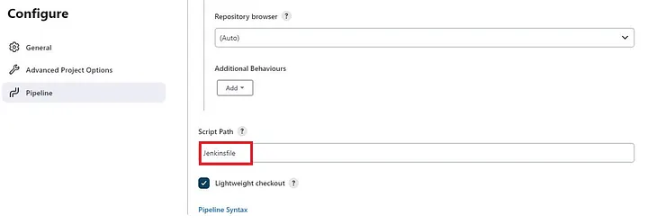

Click on Apply and Save.

Build the Pipeline by clicking on the Build Now button on the left navigation bar.

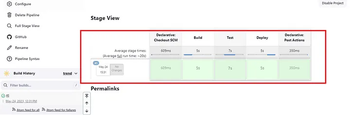

The above screenshot shows that the build has been successful. We can also verify by checking our Docker Hub Account to see whether the Image has been uploaded or not:

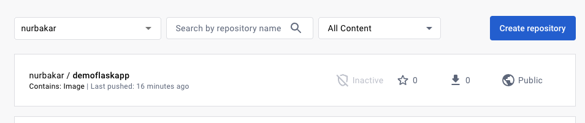

Step 7: Adding Webhook to our Jenkins Pipeline
A Webhook, also known as a Web Callback or HTTP push API is a mechanism for an application to provide real-time data to other apps. A Webhook sends data to other applications in real-time, so you get it right away.

To add a webhook in our GitHub repo go to the settings, click on webhooks, and then on Add webhook as shown below:

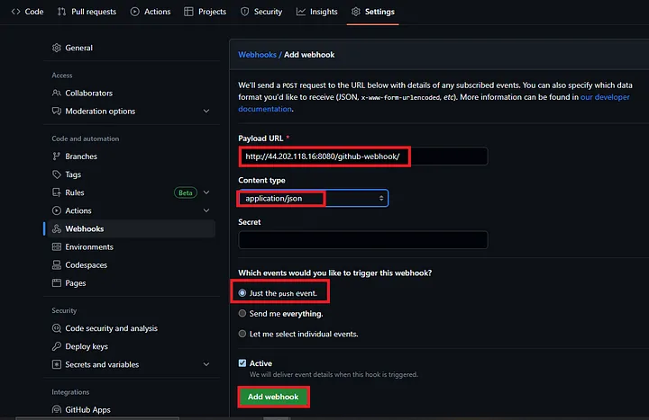

Click on Add Webhook to proceed.

Now under Build Triggers select the option GitHub hook trigger for GITScm polling, click on Apply and Save to continue.

When Jenkins receives a GitHub push hook, GitHub Plugin checks to see whether the hook came from a GitHub repository which matches the Git repository defined in SCM/Git section of this job. If they match and this option is enabled, GitHub Plugin triggers a one-time polling on GITScm.

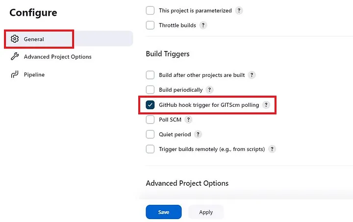

Now After that, we will install the GitHub Integration plugin in our Jenkins Server

Jenkins -> Manage Jenkins -> Manage Plugins -> Install github integration plugin

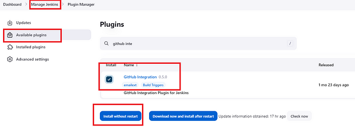

Let’s do some minor changes in README.md in our GitHub repo, commit and push your changes. which should trigger the Jenkins Job, thus displaying the successful integration of Github webhooks with Jenkins that ensured that the latest changes are tested, built, and deployed as quickly as possible.

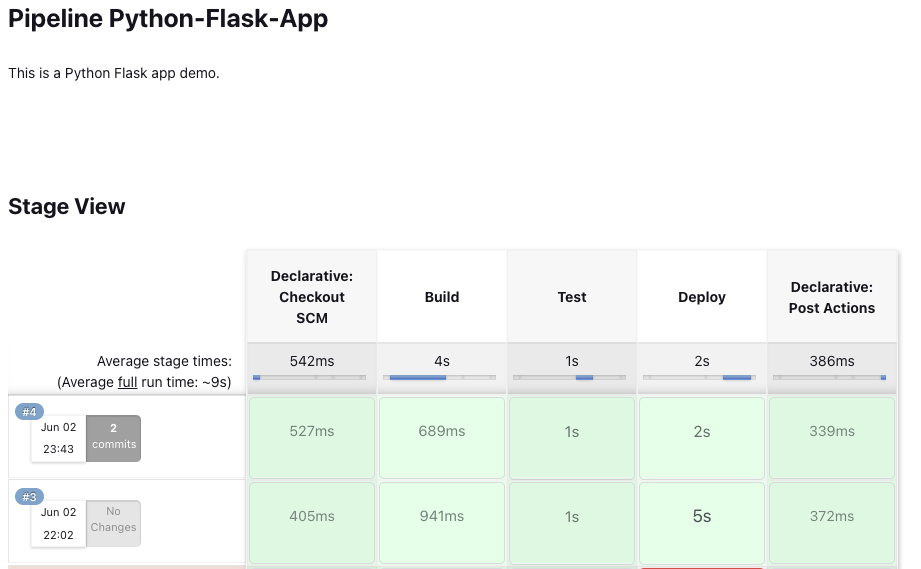

Also if we check the console output of our 4th Build we should notice the line saying Started by GitHub push by NazgulM:

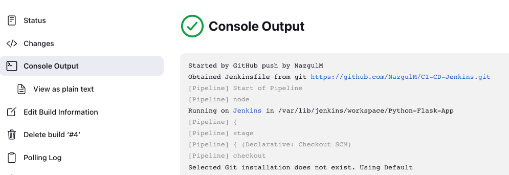

