# Deploy a Java Web App with Github, Jenkins, Maven, and Tomcat on AWS [Step-by-Step Process]

Agenda:

Setup Jenkins
Setup & Configure Maven and Git
Setup Tomcat Server
Integrating GitHub, Maven, and Tomcat Server with Jenkins
Create a CI and CD job
Test the deployment

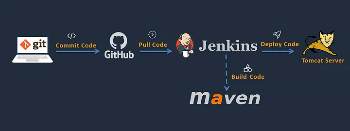

Prerequisites:

AWS Account
Git/ Github Account with the Source Code
A local machine with CLI Access
Step 1: Setup Jenkins Server on AWS EC2 Instance
Setup a Linux EC2 Instance
Install Java
Install Jenkins
Start Jenkins
Access Web UI on port 8080

Log in to the Amazon management console, open EC2 Dashboard, click on the Launch Instance drop-down list, and click on Launch Instance as shown below:

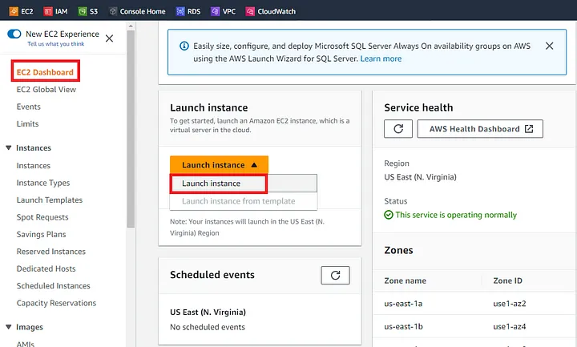

For this demo, we will select Amazon Linux 3 AMI which is free tier eligible.Choose an Instance Type. Here you can select the type of machine, number of vCPUs, and memory that you want to have. Select t2.micro which is free-tier eligible.

Now under Network Settings, Choose the default VPC with Auto-assign public IP in enable mode. Create a new Security Group, provide a name for your security group, allow ssh traffic, and custom default TCP port of 8080 which is used by Jenkins.

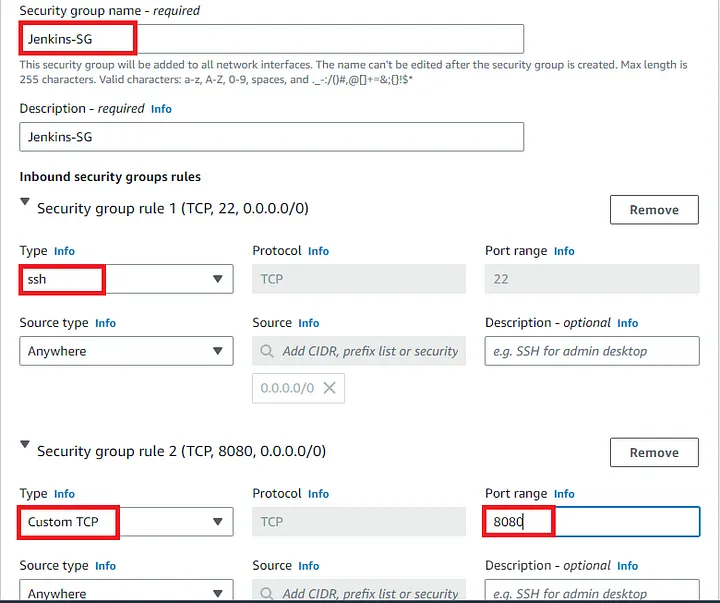

Rest of the settings we will keep them at default and go ahead and click on Launch Instance. 
Now connect to instance wizard will open, go to SSH client tab and copy the provided chmod and SSH command:

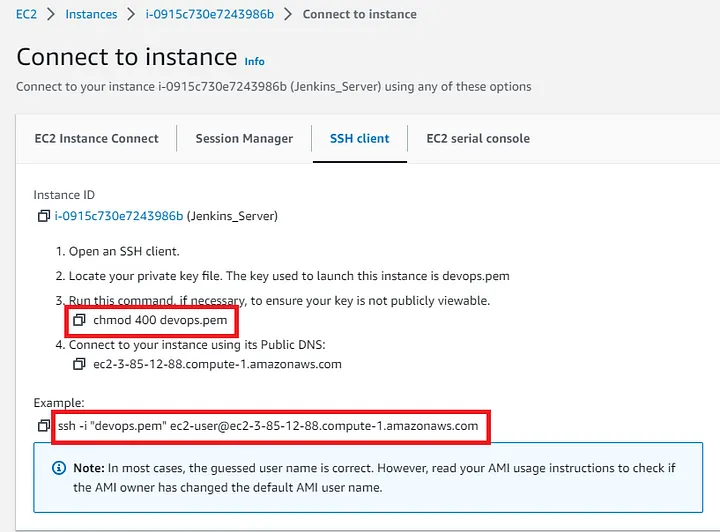

Install Java, Jenkins.
Now in order to install any plugin we need to select Available Plugins, search for Github Integration, select the plugin, and finally click on Install without restart.

Step 3: Integrate Maven with Jenkins
Setup Maven on Jenkins Server
Setup Environment Variables
JAVA_HOME,M2,M2_HOME
Install Maven Plugin
Configure Maven and Java
To install Maven on our Jenkins Server we will switch to the /opt directory and download the Maven package:

```
sudo wget https://dlcdn.apache.org/maven/maven-3/3.9.2/binaries/apache-maven-3.9.2-bin.tar.gz

Step 2: Untar the mvn package to the /opt folder.
sudo tar xvf apache-maven-3.9.2-bin.tar.gz

Step 3: Create a symbolic link to the maven folder. This way, when you have a new version of maven, you just have to update the symbolic link and the path variables remain the same.
sudo ln -s /opt/apache-maven-3.9.2/ /opt/maven

Add Maven Folder To System PATH
To access the mvn command systemwide, you need to either set the M2_HOME environment variable or add /opt/maven to the system PATH.

We will do both by adding them to the profile.d folder. So that every time the shell starts, it gets sourced and the mvn command will be available system-wide.

Step 1: Create a script file named maven.sh in the profile.d folder.

sudo vi /etc/profile.d/maven.sh
Step 2: Add the following to the script and save the file.

export M2_HOME=/opt/maven
export PATH=${M2_HOME}/bin:${PATH}
Step 3: Add execute permission to the maven.sh script.

sudo chmod +x /etc/profile.d/maven.sh

Step 4: Source the script for changes to take immediate effect.

source /etc/profile.d/maven.sh

Step 5: Verify maven installation

mvn -version
Apache Maven 3.9.2 (c9616018c7a021c1c39be70fb2843d6f5f9b8a1c)
Maven home: /opt/maven
Java version: 11.0.19, vendor: Amazon.com Inc., runtime: /usr/lib/jvm/java-11-amazon-corretto.x86_64
Default locale: en, platform encoding: UTF-8
OS name: "linux", version: "6.1.27-43.48.amzn2023.x86_64", arch: "amd64", family: "unix"
```

Now we need to update the paths where Java and Maven have been installed in the Jenkins UI. We will first install the Maven Integration Plugin as shown below:

```
Find out where JAVA is!
file $(which java)
/usr/bin/java: symbolic link to `/etc/alternatives/java'

The above output shows that JAVA is pointing to a /etc/alternatives/java file but that is not the actual location of JAVA hence you will need to dig in more to fetch its actual path.

Follow the lead!
In the previous step, we located /etc/alternatives/java file this file will get us to the actual location where JAVA config files are.

Run the file command on that location /etc/alternatives/java

file /etc/alternatives/java
/etc/alternatives/java: symbolic link to /usr/lib/jvm/java-11-amazon-corretto.x86_64/bin/java
file /usr/lib/jvm/java-11-amazon-corretto.x86_64/bin/java
/usr/lib/jvm/java-11-amazon-corretto.x86_64/bin/java: ELF 64-bit LSB pie executable, x86-64, version 1 (SYSV), dynamically linked, interpreter /lib64/ld-linux-x86-64.so.2, BuildID[sha1]=96427e06441ee0d9063e2c6d61b2bad25e619d96, for GNU/Linux 3.2.0, not stripped

Set JAVA environment variable 
To set the JAVA_HOME environment variables on Linux/Unix go to .baschrc file.

Note: .bashrc file is different for each user in Linux, hence you will need to update the same file for every user you want to set environment variable for.

Copy paste below two lines in the .bashrc file found in home the directory of ec2-user and root user:

 export JAVA_HOME="/usr/lib/jvm/java-11-amazon-corretto.x86_64"

 PATH=$JAVA_HOME/bin:$PATH
Save the file and run the following command:

source .bashrc
Note: Running the source command is mandatory otherwise you will not see the environment variable set.

Alternatively, you can also set $PATH variable through the command line:

Run the following command to add $JAVA_HOME variable to $PATH:

$ export PATH=$PATH:$JAVA_HOME/bin
That’s it! You’ve successfully set the environment variable for JAVA on EC2.

You check the JAVA and environment variable using this command :

$ echo $JAVA_HOME
$ echo $PATH
```

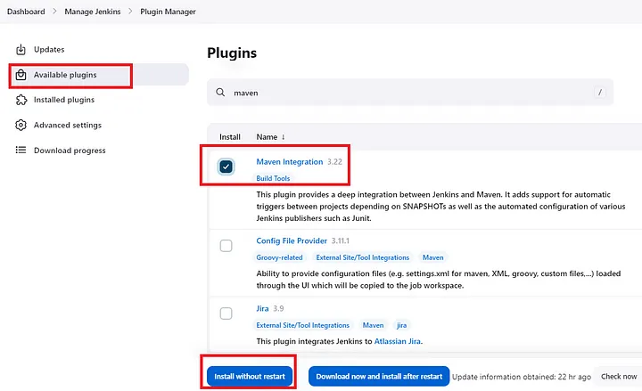

Step 4: Setup Tomcat Server
Setup a Linux EC2 Instance
Install Java
Configure Tomcat
Start Tomcat Server
Access Web UI on port 8080
Let’s first create the Amazon Linux 2 EC2 Instance. Here we will skip the steps as we have already seen the creation of EC2 in the earlier steps.

Install Java on the Tomcat Server

```
sudo yum update
sudo dnf install java-11-amazon-corretto -y

java -version
openjdk version "11.0.19" 2023-04-18 LTS
OpenJDK Runtime Environment Corretto-11.0.19.7.1 (build 11.0.19+7-LTS)
OpenJDK 64-Bit Server VM Corretto-11.0.19.7.1 (build 11.0.19+7-LTS, mixed mode)

Install Tomcat:

sudo -i

Go to tomcat.apache.org/download and find the latest stable version of tomcat, as this tutorial wrote, tomcat 10.1.9 is the latest stable we can use. Get the URL address of "tar.gz" file below;
wget https://dlcdn.apache.org/tomcat/tomcat-10/v10.1.9/bin/apache-tomcat-10.1.9.tar.gz

Now extract the file as:
tar -zxvf apache-tomcat-10.1.9.tar.gz

cd apache-tomcat-10.1.9/
cd bin/

ls -ltr
//to check the status of the startup services
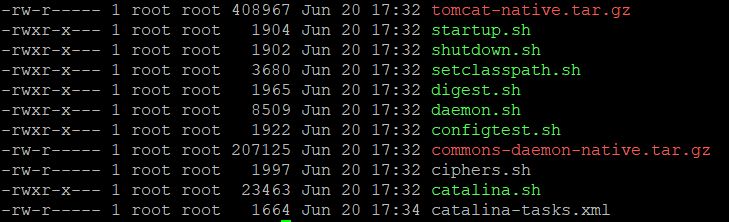

No full permission to execute startup & shutdown services
chmod +x startup.sh
chmod +x shutdown.sh

//For all users to execute this script

//Now lets start tomcat service
 ./startup.sh

Change port number from 8080 to 8090 (as Our Jenkins on AWS is also listening to the port 8080)
Browse to conf sub-directory under Tomcat directory and open server.xml file for editing using ‘nano’ command (vi command can also be used).

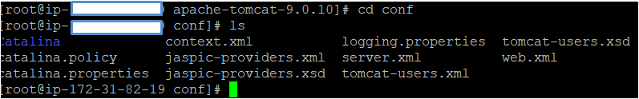

nano server.xml

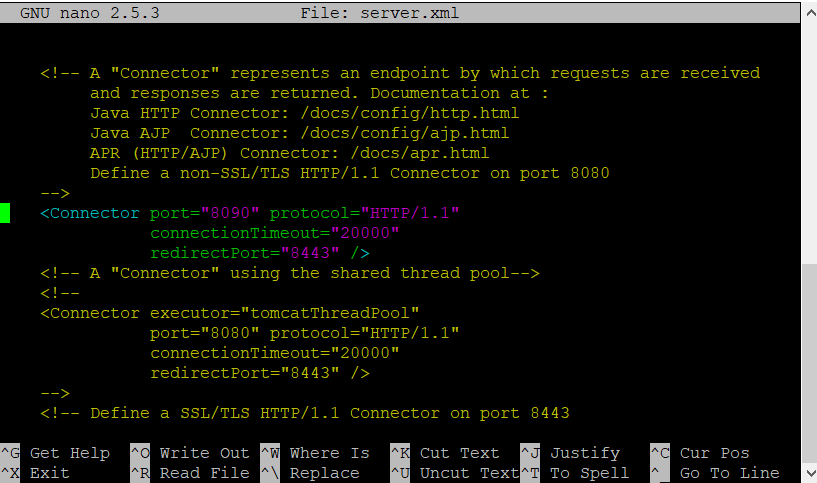

Restart the tomcat service (browse to the bin folder)

./shutdown.sh

./startup.sh

Step 7.  Allow port no 8090 under security group in AWS
Go to Your AWS account –> ec2 linux instance

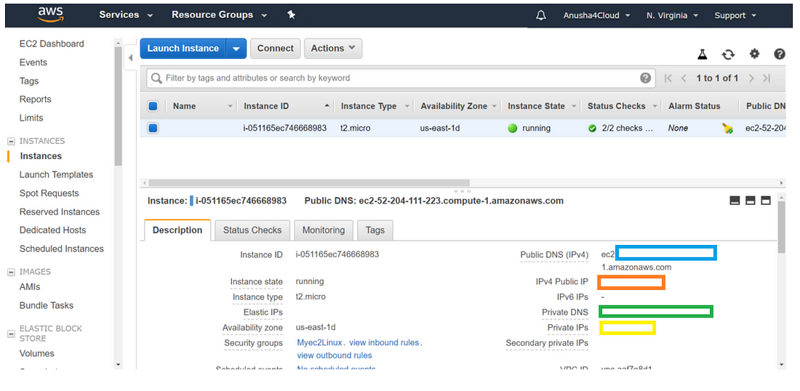

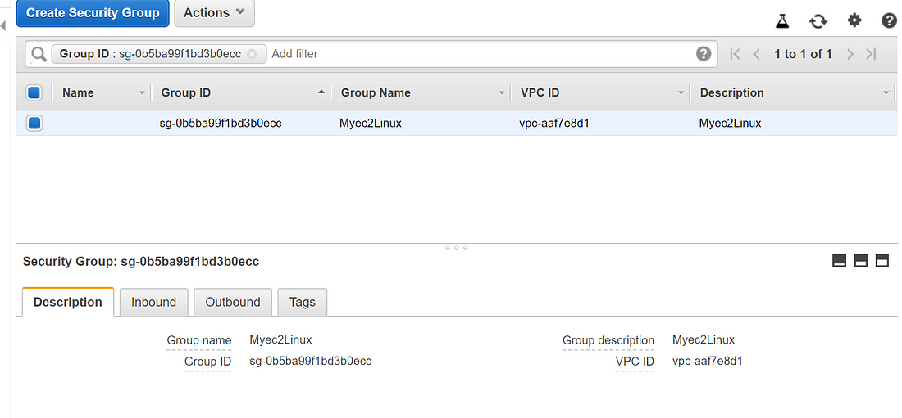

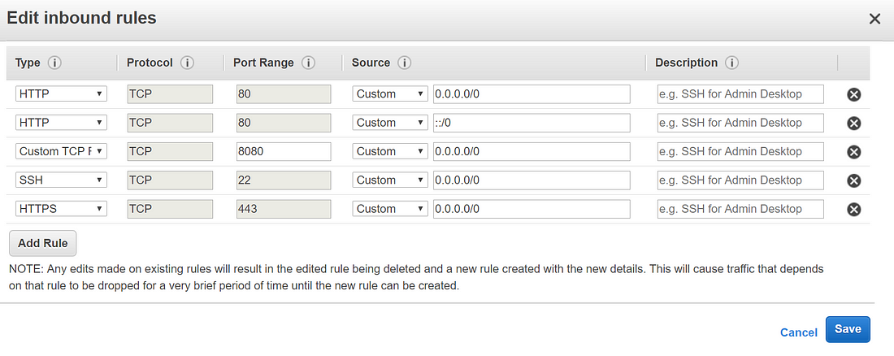

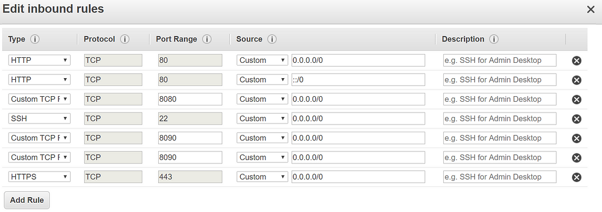

Step 8: Edit the context.xml
By default the manager is only accessible from a browser running on the same machine as Tomcat. Therefore to modify this restriction, go to context.xml file and comment out the default IP address.

Use the ‘find’ command to find the context.xml

find / -name context.xml
You will get a list, and edit context.xml within webapp, both under host-manager and manager.

find / -name context.xml
/opt/tomcat/conf/context.xml
/opt/tomcat/webapps/docs/META-INF/context.xml
/opt/tomcat/webapps/examples/META-INF/context.xml
/opt/tomcat/webapps/host-manager/META-INF/context.xml
/opt/tomcat/webapps/manager/META-INF/context.xml
/root/apache-tomcat-10.1.9/conf/context.xml
/root/apache-tomcat-10.1.9/webapps/docs/META-INF/context.xml
/root/apache-tomcat-10.1.9/webapps/examples/META-INF/context.xml
/root/apache-tomcat-10.1.9/webapps/host-manager/META-INF/context.xml
/root/apache-tomcat-10.1.9/webapps/manager/META-INF/context.xml

nano /opt/tomcat/webapps/host-manager/META-INF/context.xml

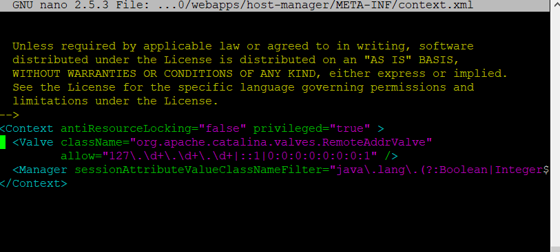

Specify the roles and the users:
Browse to the conf directory and open the tomcat-users.xml for editing.

find / -name context.xml

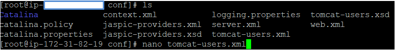
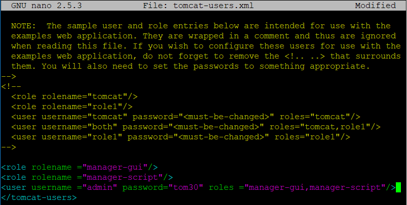

If you have errors : Connection refuse go to 
nano /opt/tomcat/conf/server.xml

add: useIPVHosts="true"
<Connector port="8090" protocol="HTTP/1.1" 
           connectionTimeout="20000" 
           URIEncoding="UTF-8"
           redirectPort="8443"
           useIPVHosts="true" />

Restart tomcat
./shutdown.sh
./startup.sh
It should work
```

Step 5: Integrate Tomcat with Jenkins
Install “Deploy to container” plugin on Jenkins UI
Configure the tomcat server with credentials
Now let’s first install the Deploy to Container plugin. Go to manage Jenkins > Manage Plugins:

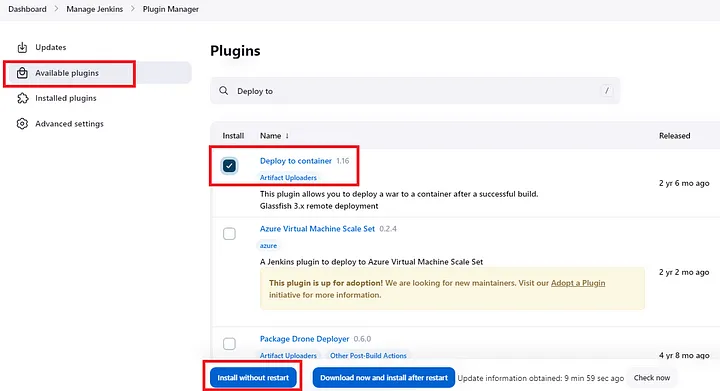 
